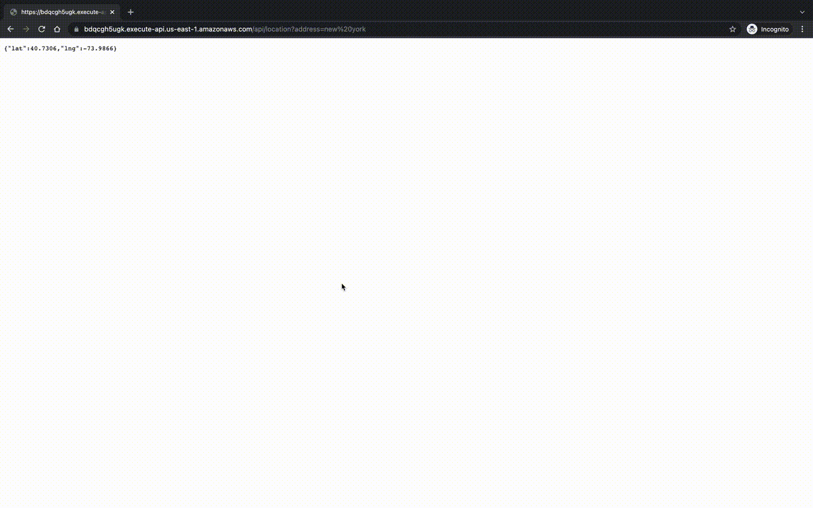

# Setup
```
cd app && yarn
chmod +x deploy.sh
```

# Run locally
### 1 Start DB in docker
```
docker-compose up
```

### 2 Start application and check location endpoint
```
cd app && yarn start:dev
```

### 3 Check GraphQL
### 3.1 Create User


### 3.2 Update User


### 3.3 Delete User


### 3.4 Get User by id


### 3.5 Get list


## 4 Deploy to lambda with terraform
```
./deploy.sh
```

### 4.1 run location endpoint on Lambda


### 4.2 run location endpoint on Lambda


